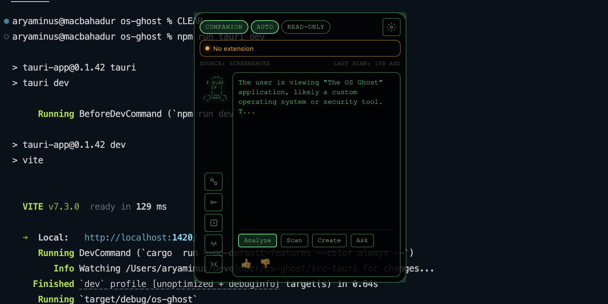

# The OS Ghost

A screen-aware meta-game where an AI entity lives in your desktop, transforming your browser into an interactive puzzle box.



## Features

- **Transparent overlay** - Ghost floats above your desktop
- **Browser integration** - Chrome extension tracks navigation
- **AI-powered** - Gemini Vision analyzes your screen
- **Local AI Support** - Optional Ollama integration for privacy
- **Multi-Agent System** - Specialized agents for different tasks
- **Workflow Automation** - Automate repetitive actions
- **Privacy & Sandbox** - Strict security boundaries and read-only modes
- **Hot/cold feedback** - Get closer to solving mysteries
- **Persistent memory** - Progress saves between sessions

### Advanced Features (Inspired by ZeroClaw, IronClaw, Moltis)

- **Multi-Channel Support** - Connect via Telegram, Discord, Slack
- **Tunnel Integration** - Expose local server via Cloudflare, Tailscale, or ngrok
- **AIEOS Identity** - Define AI personas with standardized identity format
- **Observability** - Prometheus metrics and OpenTelemetry tracing
- **Hybrid Memory** - SQLite + FTS5 + vector search for rich memory
- **Heartbeat/Scheduler** - Periodic task execution for autonomous agents
- **Hook System** - Lifecycle hooks (BeforeToolCall, AfterToolCall, etc.)
- **Workspace Context** - TOOLS.md, AGENTS.md, BOOT.md context files
- **Scheduled Tasks** - Cron-based task scheduling
- **Config Validation** - TOML configuration validation
- **Security Features**:
  - Leak Detection - Scan for 20+ credential patterns
  - HTTP Allowlisting - Domain/path wildcards for tool access
  - Tool Output Sanitization - Strip secrets before LLM feedback

## Installation

### Option 1: Download Release (Recommended)

1. Download the latest release for your platform from [GitHub Releases](https://github.com/aryaminus/os-ghost/releases)
2. Install the Chrome extension: [OS Ghost Bridge](https://chromewebstore.google.com/detail/os-ghost-bridge/iakaaklohlcdhoalipmmljopmjnhbcdn)
3. Run the app - it automatically registers the Chrome extension bridge on first launch

| Platform | Download |
| :--- | :--- |
| macOS (Apple Silicon) | `The.OS.Ghost_x.x.x_aarch64.dmg` |
| macOS (Intel) | `The.OS.Ghost_x.x.x_x64.dmg` |
| Windows | `The.OS.Ghost_x.x.x_x64-setup.exe` |
| Linux | `the-os-ghost_x.x.x_amd64.deb` / `.AppImage` |

### Option 2: Build from Source (Development)

#### Prerequisites

- Node.js 18+
- Rust (via rustup)
- Chrome/Chromium browser
- Gemini API key

#### Setup

```bash
# Clone the repository
git clone https://github.com/aryaminus/os-ghost.git
cd os-ghost

# Run the development setup script
./scripts/install.sh

# Start in development mode
npm run tauri dev
```

The setup script will:

- Install npm dependencies
- Build the native messaging bridge
- Register the Chrome extension manifest for development

## Chrome Extension

The Ghost communicates with your browser through a Chrome extension.

**For Release Users:** Install from [Chrome Web Store](https://chromewebstore.google.com/detail/os-ghost-bridge/iakaaklohlcdhoalipmmljopmjnhbcdn)

**For Developers:** You can also load the unpacked extension from `ghost-extension/` directory:

1. Open `chrome://extensions/`
2. Enable "Developer mode"
3. Click "Load unpacked"
4. Select the `ghost-extension` folder

## Configuration

The Ghost supports extensive configuration for AI providers (Gemini/Ollama), privacy settings, and autonomy levels.

For detailed configuration instructions, see [Configuration Guide](docs/CONFIGURATION.md).

### Quick Start: API Key

```bash
export GEMINI_API_KEY='your-api-key-here'
```

## How to Play

1. Start the app - Ghost appears on your desktop
2. Read the clue in the Ghost's dialogue box
3. Browse the web to find the answer
4. Watch the proximity indicator heat up as you get closer
5. Find the correct page to unlock the next memory fragment

## Architecture

The OS Ghost uses a hybrid architecture with Rust (Tauri), React, and a Chrome Extension.
For a deep dive into the system design, Agents, and IPC, see [Architecture Guide](docs/ARCHITECTURE.md).

## Project Structure

```text
os-ghost/
├── src/                    # React frontend
├── src-tauri/              # Rust backend
│   ├── src/
│   │   ├── lib.rs          # Main app logic
│   │   ├── bridge.rs       # Chrome extension bridge
│   │   └── bin/
│   │       └── native_bridge.rs  # Native messaging binary
├── ghost-extension/        # Chrome extension source
├── docs/                   # Documentation
└── scripts/                # Development scripts
```

## Development

```bash
# Run in development mode
npm run tauri dev

# Run Rust tests
cd src-tauri && cargo test

# Build for production
npm run tauri build
```

## Release & Deployment

For details on the **CI/CD Pipeline**, **Auto-Versioning**, and **Code Signing** (macOS/Windows), see [Release Pipeline Docs](docs/RELEASE_PIPELINE.md).

## Troubleshooting

### Chrome extension not connecting

1. Ensure the app is running
2. Check that the extension is installed and enabled
3. For development: verify the manifest was registered by running `./scripts/install.sh`
4. For releases: restart the app (it auto-registers on launch)

### "Native host not found" error

The native messaging manifest may not be registered.

- **Release builds**: Restart the app
- **Development**: Run `./scripts/install.sh`

### macOS Gatekeeper warning

If macOS blocks the app:

1. Go to System Settings > Privacy & Security
2. Click "Open Anyway" next to the OS Ghost warning

## License

MIT
